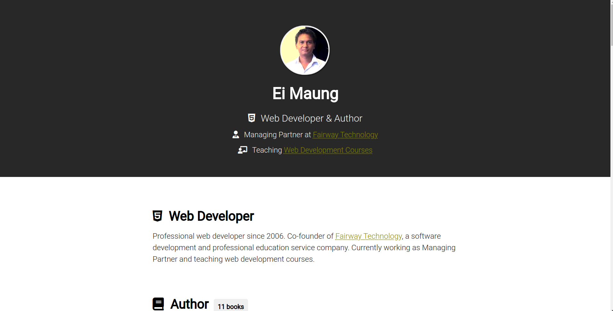

# Cloning [Sayar Ei Maung website] (https://www.eimaung.com) to practice frontend web dev using HTML and CSS.


	## Table of contents

	- [Overview](#overview)
	  - [The challenge](#the-challenge)
	  - [Screenshot](#screenshot)
	  - [Links](#links)
	- [My process](#my-process)
	  - [Built with](#built-with)
	  - [What I learned](#what-i-learned)
	- [Author](#author)

	## Overview

	### The challenge

	Website should be able to:

	- Look as the same as [the original website](https://www.eimaung.com)

	### Screenshot

	

	### Links

	- Solution URL: [Solution](https://github.com/laminkoko243/eimaung.com-clone/)
	- Live Site URL: [Live Site](https://laminkoko243.github.io/eimaung.com-clone/)

	## My process

	### Built with

	- Semantic HTML5 markup
	- CSS custom properties
	- Flexbox

	### What I learned


	```css
	li:nth-child(even) {
		background-color: #e5e5e5;
	}
	```

	## Author

	- Website - [La Min Ko Ko](https://www.laminkoko.com)
	- Frontend Mentor - [@laminkoko243](https://www.frontendmentor.io/profile/laminkoko243)
	- Twitter - [@laminkoko243](https://twitter.com/laminkoko243)
	- Facebook - [@laminkoko243] (https://www.facebook.com/laminkoko243)
	- LinkedIn - [@laminkoko] (https://www.linkedin.com/in/laminkoko/)
	- Github - [@laminkoko243] (https://github.com/laminkoko243)
